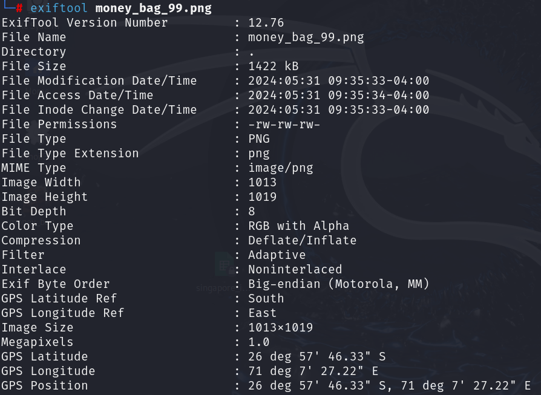
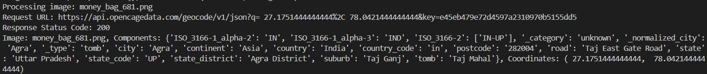

Find a bag of money

#Description:
Find the money sack, which is hidden in a landmark.
attached is a downloadable file strings.txt containing "bafybeicjfojuswk3uzb54f76qxmwcfkf7tpf3lxg6u36mazkjk5a2gtybq"

After researching, the given string appears to be a content identifier used in IPFS (interplanetary file system). Searching "https://ipfs.io/ipfs/bafybeicjfojuswk3uzb54f76qxmwcfkf7tpf3lxg6u36mazkjk5a2gtybq" in the browser downloaded a file containing money bags. 

Upon inspection of each image using exiftool, i notice that each of it has a different latitude and longtitude, mostly in oceans.


Now create a script to find the landmark.
import pandas as pd
import requests

```
# Load the CSV file into a DataFrame
df = pd.read_csv('test.csv', header=None, names=['Filename', 'Latitude', 'Longitude', 'In Singapore?'])

# Function to identify landmarks using OpenCage Geocoder API
def identify_landmark(latitude, longitude, api_key):
    url = f'https://api.opencagedata.com/geocode/v1/json?q={latitude}%2C{longitude}&key={api_key}'
    print(f"Request URL: {url}")
    try:
        response = requests.get(url)
        print(f"Response Status Code: {response.status_code}")
        response.raise_for_status()  # Raise an exception for HTTP errors
        data = response.json()
        if 'results' in data and data['results']:
            components = data['results'][0]['components']
            return components
    except requests.exceptions.RequestException as e:
        print(f"Error fetching data: {e}")
    return {}

# OpenCage Geocoder API key
api_key = ''

# Process each row in the DataFrame
for index, row in df.iterrows():
    image = row['Filename']
    latitude = row['Latitude']
    longitude = row['Longitude']
    checked = row['In Singapore?']

    # if checked == 'No':
    print(f"Processing image: {image}")
    components = identify_landmark(latitude, longitude, api_key)
    print(f'Image: {image}, Components: {components}, Coordinates: ({latitude}, {longitude})')
```

only 1 coordinate stood out among the rest, which is taj mahal.

flag: CDDC24{taj_mahal}
