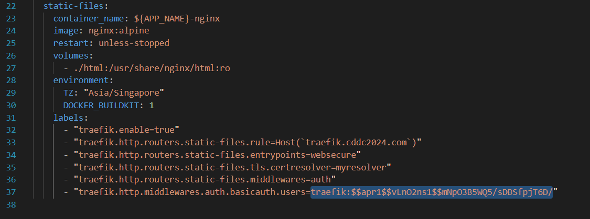
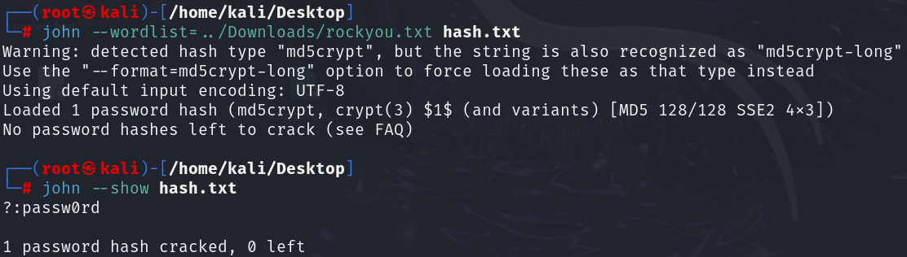

Opening the website in burpsuite showed that it is using basic authentication.

I noticed that in the docker-compose.yml file, the credentials were given
"traefik:$$apr1$$vLnO2ns1$$mNpO3B5WQ5/sDBSfpjT6D/"

Using john the ripper, i managed to get the password.

Using traefik:passw0rd, i managed to log in and get the flag. [forgot to record the flag :(]